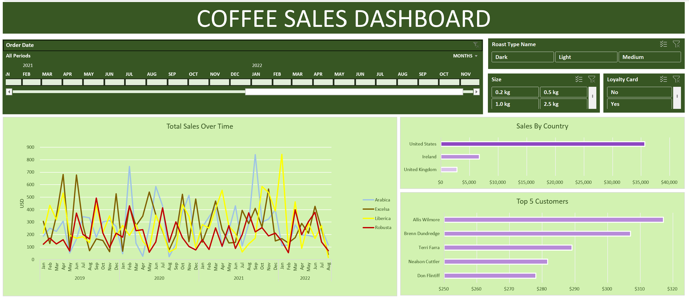

# Coffee-Sales-Dashboard
Comprehensive Excel Sales Dashboard featuring lookup-based data modeling, PivotCharts, timeline filters, slicers, and automated visual insights.

# ☕ Coffee Sales Dashboard

An interactive Excel dashboard analyzing coffee sales using lookup functions, PivotTables, and slicers.

---

## Features

* Total Sales Over Time (Line Chart)
* Sales by Country (Bar Chart)
* Top 5 Customers (Bar Chart)
* Timeline and slicers for filtering (Loyalty Card, Roast Type, Size)

---

## Skills Demonstrated

* Basic data preparation and structuring (using Excel tables and formulas)
* Data modeling using lookup functions (XLOOKUP, INDEX-MATCH)
* PivotTables & PivotCharts for analysis
* Interactive dashboard design with slicers and timeline filters

